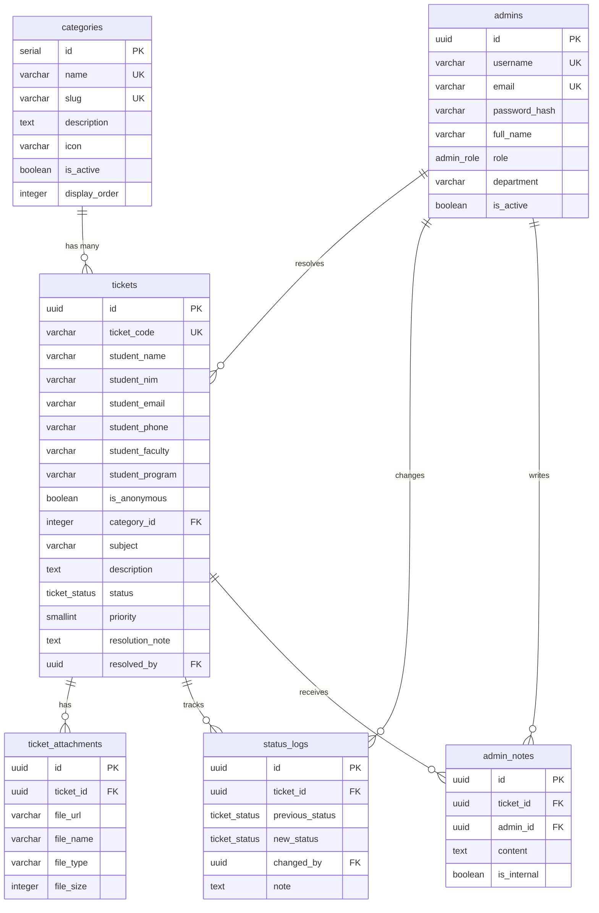
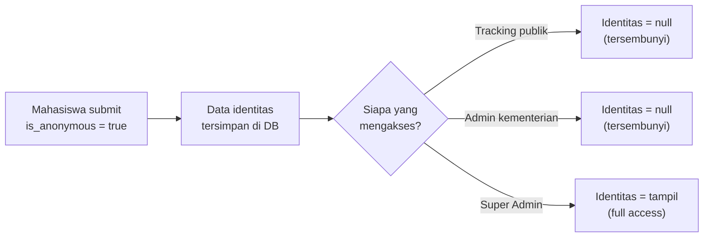

# 🏗️ Portal Advokasi Terpadu — Arsitektur Database & API

## Database Schema

File: [`database-schema.sql`](file:///c:/Users/andik/OneDrive/Documents/TEKNIK INFORMATIKA/Project/WEB BEM/Portal web Advokasi/docs/database-schema.sql)

### Entity Relationship Diagram

### Ringkasan 6 Tabel

| # | Tabel | Fungsi | Relasi |
|---|-------|--------|--------|
| 1 | **`categories`** | Kategori laporan (UKT, Fasilitas, Akademik, dll) | → `tickets` |
| 2 | **`admins`** | Akun admin kementerian BEM | → `tickets`, `status_logs`, `admin_notes` |
| 3 | **`tickets`** | **Tabel utama** — data laporan mahasiswa + identitas | ← `categories`, `admins` |
| 4 | **`ticket_attachments`** | Lampiran bukti pendukung | ← `tickets` |
| 5 | **`status_logs`** | Audit trail perubahan status | ← `tickets`, `admins` |
| 6 | **`admin_notes`** | Catatan internal/publik admin pada tiket | ← `tickets`, `admins` |

### Fitur Database Tambahan

- ✅ **10 Indexes** teroptimasi untuk query yang paling sering digunakan
- ✅ **4 Triggers** auto-update `updated_at` pada setiap perubahan record
- ✅ **Function** `generate_ticket_code()` — auto-generate kode `ADV-YYMM-XXX`
- ✅ **Seed data** 6 kategori default + template super admin
- ✅ **Enum types** untuk status tiket dan role admin

---

## API Endpoints

File: [`api-endpoints.md`](file:///c:/Users/andik/OneDrive/Documents/TEKNIK INFORMATIKA/Project/WEB BEM/Portal web Advokasi/docs/api-endpoints.md)

### Ringkasan Total: **28 Endpoints**

| Grup | Jumlah | Auth? | Akses |
|------|--------|-------|-------|
| 📋 Publik (Laporan & Tracking) | 4 | ❌ | Mahasiswa |
| 🔐 Autentikasi | 4 | 🔓 | Admin |
| 🎫 Manajemen Tiket | 6 | ✅ | Admin (delete: super_admin) |
| 💬 Catatan Tiket | 4 | ✅ | Admin |
| 📁 Manajemen Kategori | 5 | ✅ | Admin |
| 📊 Statistik Dashboard | 3 | ✅ | Admin |
| 👤 Manajemen User | 5 | ✅ | Super Admin Only |

### Mekanisme Anonimitas

> [!IMPORTANT]
> Identitas asli mahasiswa (nama, NIM) **selalu tersimpan** di database untuk kebutuhan validasi internal. Mekanisme penyembunyian terjadi di **layer API** melalui middleware `anonymityFilter`, bukan di database.

---

## Keputusan Desain Penting

| Keputusan | Alasan |
|-----------|--------|
| UUID untuk primary key tabel utama | Lebih aman untuk exposed ID di URL, menghindari enumeration attack |
| SERIAL untuk `categories.id` | Tabel referensi kecil, integer lebih efisien |
| Ticket code di-generate via DB function | Menjamin atomicity dan menghindari race condition saat concurrent insert |
| `is_internal` pada `admin_notes` | Memungkinkan admin memberi respon publik kepada pelapor tanpa tabel terpisah |
| Composite index `(status, category_id, created_at)` | Mengoptimasi query filter admin yang paling umum |
| Soft toggle (`is_active`) untuk kategori & admin | Mencegah orphan records, data historis tetap utuh |
